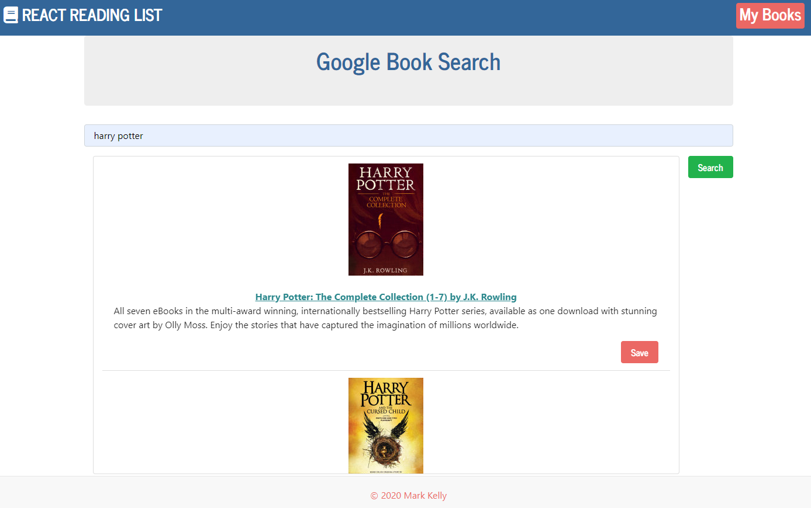

# React Google Book Search

## Description

This application allows the user to search Google Books.  The user can save the books they want as MyBooks. This allows the user to create a personalized reading list.

## Context

For users that need to keep track of books, making it easy to keep track of wanted literature and recommendations.

## App deployed on Heroku
Here's the link:
https://reactgbooklist.herokuapp.com/

- - -
